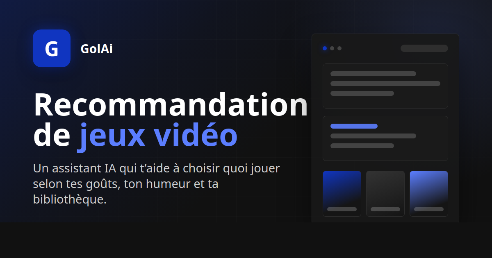
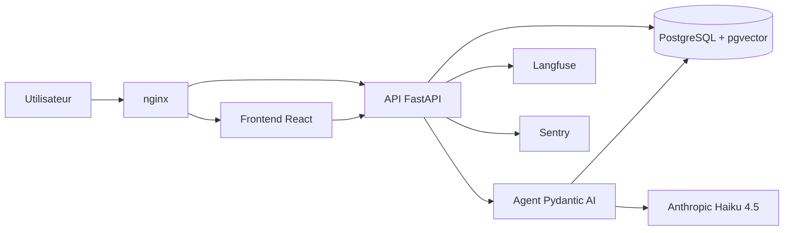

# GolAi

[](https://github.com/DavidGola/golai/actions/workflows/ci.yml)

**Recommandation de jeux vidéo**

GolAi est un agent IA qui recommande quoi jouer ensuite à partir d'une bibliothèque de jeux, d'une conversation et de signaux de préférence utilisateur. Le projet met l'accent sur un backend Python propre, un RAG explicable, une UX de chat directe et une stack observable en production.

[Demo live](https://golai.app) · [A propos](https://golai.app/about) · [Repo](https://github.com/DavidGola/golai) · [Contact](mailto:golaichat@outlook.com)



## Ce que montre le projet

- **Chat agentique** : un assistant conversationnel oriente, recherche et recommande des jeux selon le contexte utilisateur.
- **RAG hybride** : recherche lexicale PostgreSQL `pg_trgm` + similarité vectorielle `pgvector` avec embeddings BGE-M3.
- **Mémoire utilisateur** : profil long terme et bibliothèque personnelle injectés dans le contexte de l'agent.
- **Recommandations actionnables** : jaquettes, métadonnées et liens Steam affichés directement dans les réponses.
- **Production readiness** : rate limiting, backups Postgres, traces LLM Langfuse, monitoring erreurs Sentry, déploiement Docker/nginx.

## Stack technique

| Couche | Technologies |
|---|---|
| Backend | Python · FastAPI · SQLAlchemy async · Alembic |
| Agent IA | Pydantic AI · Anthropic Haiku 4.5 · prompt caching · LiteLLM routing |
| Recherche | PostgreSQL · pgvector · pg_trgm · BGE-M3 |
| Frontend | React · TypeScript · Vite · Tailwind CSS |
| Observabilité | Langfuse · Sentry · logs Docker |
| Ops | Docker Compose · nginx · GitHub Actions · Backblaze B2 |

## Architecture



## Lancer en local

Prérequis : Python 3.12, Node 22, Docker.

```bash
cp .env.example .env
docker compose up -d db
```

Backend :

```bash
backend/venv/bin/python -m pytest
backend/venv/bin/alembic upgrade head
backend/venv/bin/python -m uvicorn app.main:app --app-dir backend --reload
```

Frontend :

```bash
cd frontend
nvm use 22
npm ci
npm run dev
```

## Documentation

- [Architecture Decision Records](docs/adrs/README.md)
- [Observabilité](docs/observability.md)
- [Backup Postgres](docs/ops/backup.md)
- [Restore Postgres](docs/ops/restore.md)
- [Identité visuelle](docs/design/visual-identity.md)

## Auteur

GolAi est construit par [David Gola](https://www.linkedin.com/in/david-gola-576233181/), ingénieur IA / backend Python.

- GitHub : [DavidGola](https://github.com/DavidGola)
- LinkedIn : [David Gola](https://www.linkedin.com/in/david-gola-576233181/)
- Email : [golaichat@outlook.com](mailto:golaichat@outlook.com)
