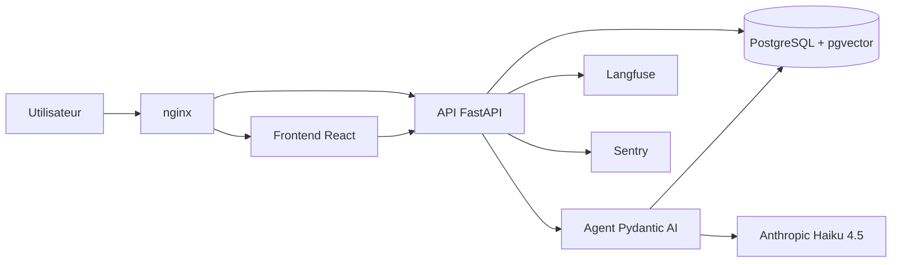

# GolAi

[](https://github.com/DavidGola/golai/actions/workflows/ci.yml)

Agent IA de recommandation de jeux vidéo. GolAi analyse votre bibliothèque, vos préférences et le contexte de la conversation pour suggérer quoi jouer ensuite — avec des recommandations actionnables (jaquettes, métadonnées, liens stores) directement dans le chat.

[Démo live](https://golai.vps.webdock.cloud/) · [À propos](https://golai.vps.webdock.cloud/about) · [Contact](mailto:golaichat@outlook.com)


---

## Fonctionnalités

**Chat agentique**
- Conversation naturelle avec l'assistant, streaming SSE en temps réel
- L'agent recherche et raisonne dans votre bibliothèque avant de répondre
- Mode anonyme sans compte (bibliothèque fictive fournie)

**Import de bibliothèque**
- Import automatique depuis Steam, PSN et Xbox
- Synchronisation des statuts (terminé, en cours, abandonné, backlog)

**RAG hybride**
- Recherche lexicale `pg_trgm` + similarité vectorielle `pgvector`
- Embeddings multilingues BGE-M3 (CPU-only, pas de dépendance cloud)
- Données enrichies : IGDB, SteamSpy, RAWG, OpenCritic, HowLongToBeat

**Mutations IA confirmées**
- L'agent propose des actions (ajouter, noter, changer statut) sous forme de cartes cliquables
- L'utilisateur confirme ou refuse avant que la bibliothèque soit modifiée

**Production readiness**
- Rate limiting Postgres `FOR UPDATE`
- Traces LLM complètes via Langfuse
- Monitoring erreurs Sentry
- Backups Postgres automatiques vers Backblaze B2

---

## Stack

| Couche | Technologies |
|---|---|
| Backend | Python 3.12 · FastAPI · SQLAlchemy async · Alembic |
| Agent IA | Pydantic AI · Anthropic Haiku 4.5 · prompt caching · LiteLLM |
| Recherche | PostgreSQL 16 · pgvector · pg_trgm · BGE-M3 |
| Sources données | Steam · PSN · Xbox · IGDB · SteamSpy · RAWG · HowLongToBeat |
| Frontend | React 18 · TypeScript · Vite · Tailwind CSS v4 |
| Observabilité | Langfuse · Sentry |
| Ops | Docker Compose · nginx · GitHub Actions · Backblaze B2 |

---

## Architecture



Le flux RAG : à chaque message, l'agent récupère les jeux pertinents de la bibliothèque (hybride lexical + vectoriel), les injecte dans le contexte avec prompt caching, puis streame la réponse en SSE.

---

## Lancer en local

**Prérequis** : Docker, Python 3.12, Node 22.

```bash
cp .env.example .env
# Renseigner au minimum : ANTHROPIC_API_KEY
```

**Avec Docker Compose (recommandé) :**

```bash
docker compose up
```

Accès : frontend `http://localhost:5173`, API `http://localhost:8000`.

**Sans Docker (développement) :**

```bash
# Base de données uniquement
docker compose up -d db

# Backend
backend/venv/bin/alembic upgrade head
backend/venv/bin/python -m uvicorn app.main:app --app-dir backend --reload

# Frontend (depuis le dossier frontend/)
nvm use 22
npm ci
npm run dev
```

**Tests backend :**

```bash
backend/venv/bin/python -m pytest
```

---

## Documentation

- [Architecture Decision Records](docs/adrs/README.md) — 18 décisions techniques documentées (MADR 4.0)
- [Workflow agentique](docs/agentic-workflow.md) — RAG, tools, guardrails, streaming
- [Stratégie routage LLM](docs/llm-routing-strategy.md)
- [Observabilité](docs/observability.md)
- [Backup / Restore Postgres](docs/ops/backup.md)
- [Identité visuelle](docs/design/visual-identity.md)

---

## Auteur

Construit par [David Gola](https://www.linkedin.com/in/david-gola-576233181/), ingénieur IA / backend Python.

[GitHub](https://github.com/DavidGola) · [LinkedIn](https://www.linkedin.com/in/david-gola-576233181/) · [golaichat@outlook.com](mailto:golaichat@outlook.com)
